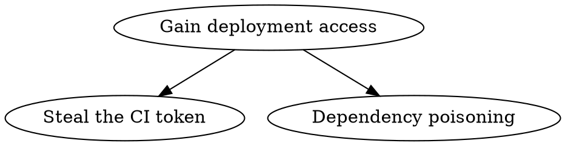

# STRIDE and attack-tree details (threat-model/references/stride-and-attack-tree.md)

Full definitions, question prompts, and templates for sections 4–6 of the main file.

## The six STRIDE questions

| Category | Full name | Question to ask | Common entry paths |
|---|---|---|---|
| S | Spoofing | Who can impersonate a legitimate principal (user/service/package)? | unsigned APIs, forgeable tokens, unverified domains |
| T | Tampering | Who can change data/code/config without detection? | plaintext transport, caches without integrity checks, writable config files |
| R | Repudiation | After an incident, can we prove "who did what"? | no audit logs, logs deletable by same-level permissions |
| I | Information disclosure | Who can see data they should not? | secrets in logs, unauthorized endpoints, error echo |
| D | Denial of service | Who can make the service/flow unavailable? | unbounded queues, external calls without timeouts, unthrottled resources |
| E | Elevation of privilege | Who can gain permissions beyond the design? | unauthorized parameters, high-privilege default accounts, injectable config |

Criterion: a cell may state "not applicable (reason)", but **the reason must relate to the asset's properties** (e.g. "a static document has no write channel → T not applicable"); "feels fine" is not a reason.

## The four trust-boundary classes

1. **In-process**: code within one process — trusted by default, unless plugins/dynamic loading exist;
2. **Inter-process**: IPC/HTTP/RPC/message queues — every crossing asks "who is on the other side, what credentials do they hold";
3. **System boundary**: local filesystem, kernel, environment variables, container runtime;
4. **External**: third-party APIs, user input, upstream repos/images — highest risk; all external input is treated as data by default (see the `prompt-injection-review` three questions).

## Drawing attack trees

- Root = the attack goal ("obtain write access to X"), leaves = preconditions ("the service is unauthenticated").
- Every leaf states its verification: one command proving the precondition holds or not; unverifiable ones are labeled "unverified assumption".
- Indented text tree example:

```text
Gain deployment access
├─ OR: steal the CI token
│   ├─ precondition: plaintext .env in repo (verify: git grep -n 'TOKEN' -- '.env*')
│   └─ precondition: workflow uses pull_request_target + secrets (verify: git grep -n 'pull_request_target' -- '.github/workflows/**')
└─ OR: dependency poisoning
    ├─ precondition: install scripts allowed (verify: npm view <pkg> scripts --json)
    └─ precondition: actions not SHA-pinned (verify: git grep -nE 'uses: [A-Za-z0-9_.-]+/[A-Za-z0-9_.-]+@v[0-9]' -- '.github/workflows/**')
```

The `dot` form is isomorphic (both the `.dot` source and the `dot -Tpng` render go into the review material):



## Mitigation landing templates

| Direction | Template wording |
|---|---|
| Eliminate | "The path disappears with this design change: <change>; acceptance: <command> proves the path no longer exists" |
| Transfer | "Handed to <existing defense>; acceptance: <location of its config/docs>" |
| Mitigate | "Add <check> at <boundary>; acceptance: <command showing a bypass attempt is blocked>" |
| Accept | "Reason: <why>; residual risk: <description>; reviewer: <name>" |

## Deliverable template

```markdown
# <component> threat model
Target: <repo> @ <commit hash> (fixed on 2026-xx-xx)
Scope: <diff or module list>
## Trust boundaries
(text or diagram; every asset states its boundary class)
## Asset inventory
| Asset | Class (data/code/channel/host) | Boundary |
## STRIDE table
(the main file's section-4 table)
## Attack tree (optional)
## Mitigation list
| Threat | Direction (eliminate/transfer/mitigate/accept) | Landing | Acceptance command |
```
